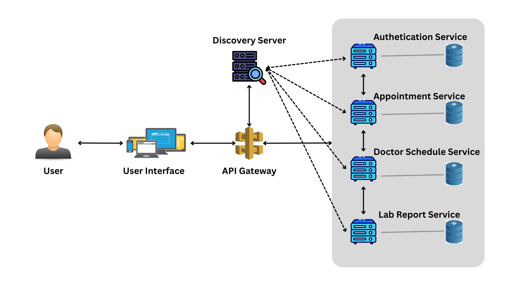
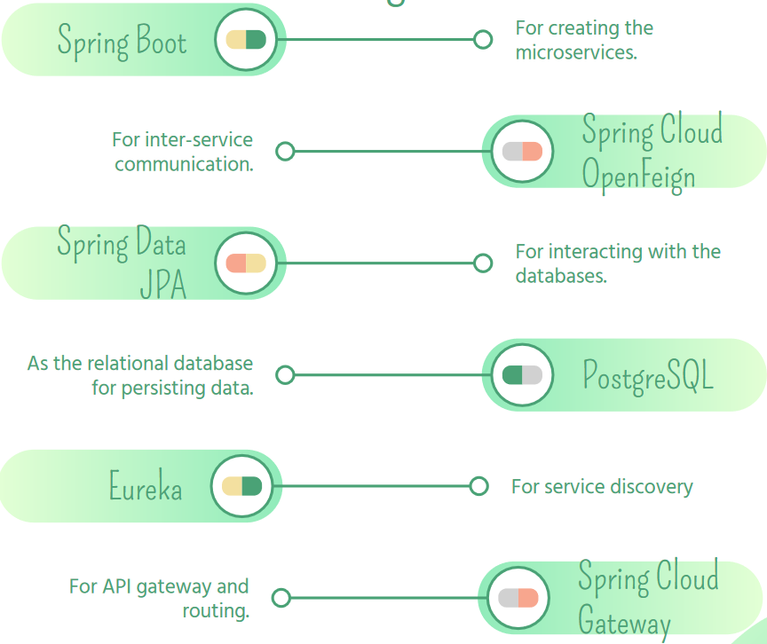

# MEDCONNECT E-Channeling Application

## Introduction

- MEDCONNECT doctor patient e-channeling Application is designed using a microservices architecture to provide a scalable and efficient platform for managing healthcare appointments. The system is composed of the following core components:

  - Authentication and Authorization Service: Ensures secure access to the application, allowing users to register, log in, and manage their accounts with appropriate access controls.
  - Doctor Appointment Service: Facilitates the booking and management of appointments.
  - Doctor Schedule Management Service: Enables doctors to efficiently manage their schedules by viewing and updating their daily appointments and locations.
  - Lab-report Service: Manages the processing and retrieval of lab reports, integrating seamlessly with the appointment system to provide patients and doctors with easy access to necessary medical information.

- The primary goal of the application is to enhance the healthcare experience by simplifying the appointment booking process, improving communication between patients and healthcare providers, and ensuring secure and efficient management of medical data. By leveraging microservices architecture, the application ensures scalability, flexibility, and resilience in handling various healthcare operations.

## Architecture

- This system is designed as a distributed system using microservice architecture.

- The system has several micro services.
  - Authentication service - manage user registration login and user roles with authentication and authorization
  - Doctor Schedule service - manage doctor schedules
  - Appointment service - manage doctor-patient appointments
  - Lab report service - manage lab reports of patients and sharing
- Microservice architecture is used to ensure scalability, modularity, fault isolation and maintainability.

## Microservices

### Implementation Methods

- MEDCONNECT utilizes the Netflix software stack for the implementation, including Spring Boot microservices development, Eureka for service discovery, and Spring Cloud Gateway for API routing.

### Core Services

1. Authentication Service: Manages user authentication and authorization (User login and registration.) All the other services communicate with this service to verify user identities and roles as patient, doctor, lab assistant, or admin.

   - REST API Endpoints:
     - POST /authenticate_user: Authenticates a user based on their username and password.
       - Input parameters - json
         
     - POST /register: Registers a new user account with the provided details.
       - Input parameters - json

     - GET /getUserByNic/{nicNumber}: Retrieves a user account based on the provided NIC number.
       - Input parameters - nicNumber

     - GET /getUserById/{id}: Retrieves a user account based on the provided user ID.
       - Input parameters - id

2. Appointment Service: Handles appointment booking and management. Interacts with Doctor Schedule Service for fetching doctor-specific appointments.

   - REST API Endpoints:

      - GET /appointment/allAppointments: Fetches all appointments. 
        - Input parameters - none 

      - POST /appointment/add: Makes an appointment 
        - Input parameters - json

      - GET /appointment/getpatientappointment/{patientId} : Retrieve a patient’s appointment using patient ID.
        - Input parameters - none 

3. Doctor Schedule Service: Manages doctor schedules and information. Each doctor can see the number of patients that made an appointment at each location for the day. Doctors can view and update the schedules also. Doctor can also obtain the lab reports of his/her patient upon request. Communicates with Appointment Service to fetch appointments and Lab report Service for lab reports.

   - REST API Endpoints:

     - GET /doctorservice/doctor/AllSchedules: Fetch all doctor schedules

       - Input parameters - none

     - GET doctorservice/doctor/location/{location}: Fetch doctor scheduled by location

       - Input parameters - location

     - GET doctorservice/doctor/doctorId/{doctorId}: Fetch all doctor schedules of a specific doctor

       - Input parameters - doctorId

     - POST /doctorservice/doctor/add: Add a schedule to a specific doctor
       - Input parameters - json

     - PUT /doctor/update/{doctorId}: Updates a doctor's schedule.
       - Input parameters - json, doctorId

     - DELETE /doctor/delete/{doctorId}: Deletes a doctor's schedule.
       - Input parameters - doctorId 

4. Lab Report Service: Manages lab reports and related data. This provides APIs for the Doctor Schedule Service to access lab reports.

   - REST API Endpoints:

     - GET /reportservice/lab_reports/get_all_requests: Fetch all lab reports

       - Input Parameters - none

     - POST/lab_reports/pdf/uploadPdf:

     - POST /reportservice/lab_reports/request_to_lab: Add lab report

       - Input parameters - json

     - GET /reportservice/lab_reports/get_request_by_status/{status}: Fetch lab reports by status

       - IInput parameters - status

     - GET /reportservice/lab_reports/serach/: Fetch lab reports by status, doctor id & patient id

       - Input parameters - status, doctorId, patientId

     - PUT /reportservice/lab_reports/updateUserStatus/{id}/{status}: Update status of the lab report
       - Input parameters - status, id
      
     - POST/lab_reports/pdf/uploadPdf:  Upload a lab report as a pdf.
       - Input parameters - file, report id

     - GET /lab_reports/pdf/getPdf/{id}: Retrieves a PDF document by its report ID.
       - Input parameters - report ID

     - GET /lab_reports/pdf/get_all_reports: Fetches all lab report PDFs from the database.
       - Input parameters - None

### Discovery Server:

- Eureka is used as the discovery server, where each service registers itself for service discovery. The server continuously monitors the availability and status of registered services.

### API Gateway:

- Spring Cloud Gateway is configured to route API requests to appropriate services, providing a single-entry point for client requests and handling concerns such as security and logging.

## User Interface

- Implementation Details: Used Vue as the frontend framework and JavaScript as the language for the frontend. Backend developed using following technologies.

- API Testing Tools: Postman is used for testing the application’s APIs, allowing for the verification of endpoints and ensuring reliable communication between services.

## Deployment

- Deployment Method: The application can be deployed in production using Docker containers to ensure consistent environments and easy scalability. Deployment can be done on local machines or in the cloud (e.g., AWS, Azure) using container orchestration tools like Kubernetes.

### Deployment Steps:

1. Local Deployment:

- Install Docker and Docker Compose on the local machine.
- Clone the GitHub repository.
- Build the Docker images using Docker Compose.
- Start the services with docker-compose up.

2. Cloud Deployment:

- Set up a Kubernetes cluster on a cloud provider.
- Deploy the Docker images to a container registry.
- Use Kubernetes configuration files (YAML) to deploy services to the cluster.
- Configure a cloud-based load balancer and API gateway for external access.

## Source Code

- GitHub repository - [GitHub](https://github.com/JeewanthaSenanayake/eChannelling)

## Development Challenges

- Challenges Faced:

  - Designing the architecture of the system.
  - Handling inter-service communication.
  - Ensuring secure communication between microservices and managing proper authentication and authorization.
  - Team coordination and collaboration.
  - Handling errors from dependent services and ensuring system reliability.

- Solutions:
  - Adopted microservices architecture for scalability and independence.
  - Used Eureka and Spring Cloud Gateway for efficient service discovery and routing.
  - Implemented robust security mechanisms for secure communication.
  - Used agile methodologies and communication tools for effective team coordination.
  - Implemented error handling and retries for improved service resilience.
